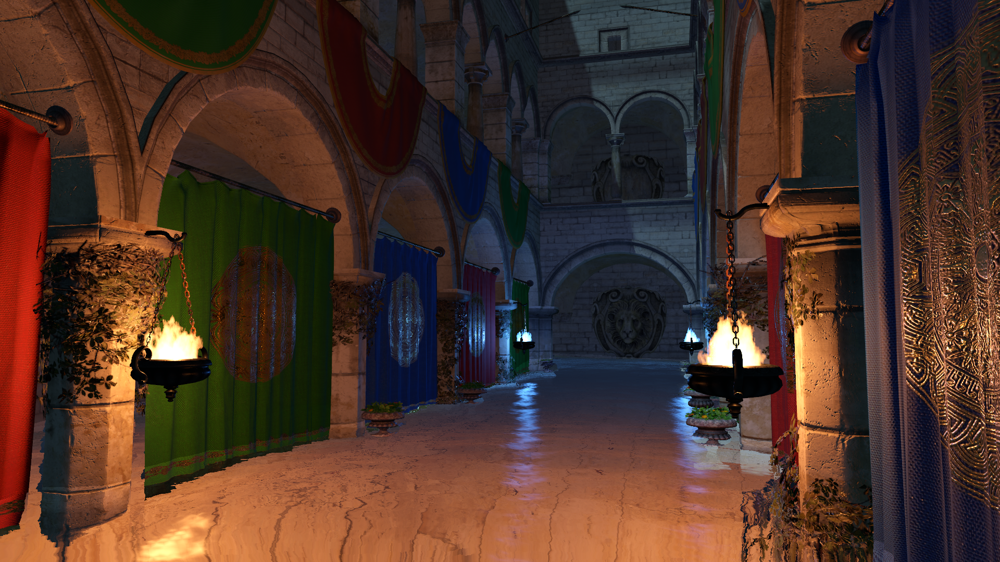
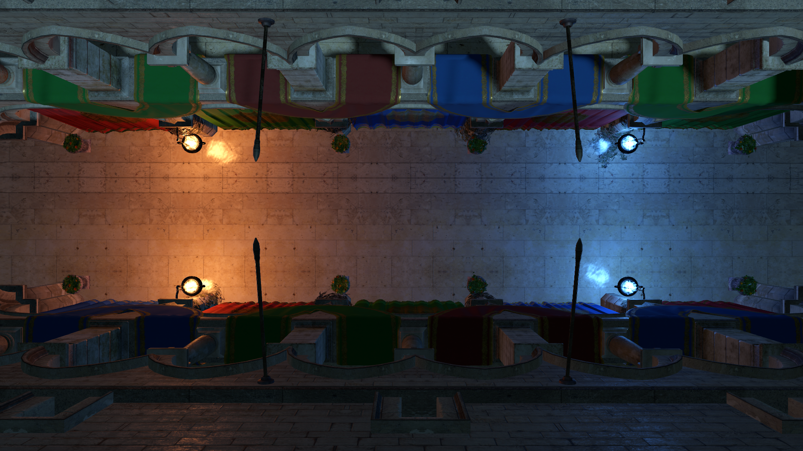

# About

A demo WebGPU project *(written partially on streams at [twitch.tv/lisyarus](twitch.tv/lisyarus))* that renders the Sponza scene with shadows, several light sources, volumetric fires, simulated cloth and water. I made it mostly to get familiar with WebGPU and to see how usable the API is right now, in Dec 2023. Turned out it is pretty much production-ready, from my perspective :)

I had more plans for it like implementing some hardcore GI, but decided to have some fun instead.

It uses wgpu-native WebGPU implementation, and SDL2 to create a window to render to.

# Links

* Trello board with ongoing tasks: https://trello.com/b/DlDOU1Hs/webgpu-demo
* Stream recordings: https://www.youtube.com/playlist?list=PLSGI94QoFYJwz6F52BsYub8ZPE3ln_wlG

# Rendering

* The base scene is rendered in a single forward pass into a multisampled 16-bit HDR buffer *(WebGPU doesn't support blending & multisampling with 32-bit textures)*
* To support per-object properties (model matrix & material properties), a uniform buffer with per-object dynamic offset is filled on each frame
* The materials use the BRDF implementation from the [glTF 2.0 specification](https://registry.khronos.org/glTF/specs/2.0/glTF-2.0.html#appendix-b-brdf-implementation)
* There is one directional light source with shadows implemented using the ESM algorithm with 15x15 separate blur
* Other light sources are point lights (read from the scene using the [KHR_lights_punctual](https://github.com/KhronosGroup/glTF/tree/main/extensions/2.0/Khronos/KHR_lights_punctual) extension); they don't have shadows, are passed to the shader in a storage buffer, and are visualized as fires via raymarching a 3D noise texture
* The HDR buffer is copied, and the water layer is rendered on top of the copy, while the original HDR buffer is sampled to support screen-space refractions
* The second buffer (with both the scene & water) is blit to the LDR screen with Uncharted 2 tone-mapping and gamma-correction. 

# Cloth simulation

* Each input material having a `cloth` property set to `true` in the `material.extras` is simulated as cloth
* The input cloth meshes are preprocessed in order to remove double-sided objects & remove small triangle patches disconnected from the base mesh
* Cloth is simulated by treating all the mesh edges as undamped springs, then adding some velocity diffusion to mimic elasticity, and some global velocity damping to emulate air friction
* Cloth is affected by gravity; you can press `[G]` to disable gravity, which leads to some fun effects
* In order to properly shade the cloth meshes, the normal and tangent vectors for cloth mesh vertices are reconstructed by iterative 3D shape matching to compute a quaternion that rotates the initial vertex local coordinate system to the current local coordinate system

# Water

* Water is represented as a heightfield, with 1024 vertices along the largest scene dimension (X or Z)
* The initial state of the heightfield is taken from a 1024x1024 noise texture
* Water is simulated by solving the 2D wave equation
* Water is rendered as a solid mesh, and combines the Fresnel-reflected light from the light sources with the refracted color of the underwater objects
* The refracted color is lightened a bit to emulate light scattering inside the water volume

# Building

To build this project, you need
* [CMake](https://cmake.org)
* [SDL2](https://www.libsdl.org/) (you can probably install it via your system's package manager)
* [wgpu-native](https://github.com/gfx-rs/wgpu-native)

To install wgpu-native, download [some release archive](https://github.com/gfx-rs/wgpu-native/releases) for your platform, and unpack it somewhere. ~~This project was built with the [v0.18.1.3](https://github.com/gfx-rs/wgpu-native/releases/tag/v0.18.1.3) release, and might not work with other version.~~ See **Update 2** and **Update 3** below.

Don't forget to check out submodules:
* [glm](https://github.com/g-truc/glm) for vector & matrix maths
* [rapidjson](https://github.com/Tencent/rapidjson) for parsing glTF scenes
* [stb](https://github.com/nothings/stb) for loading images

You can do this at clone time, using `git clone <repo-url> --recurse-submodules`. Add `--shallow-submodules` to prevent loading the whole commit history of those submodules. Otherwise, you can checkout submodules at any time after cloning the repo with `git submodule update --init --recursive`.

Then, follow the usual steps for building something with CMake:
* Create a build directory
* In the build directory, run `cmake <path-to-webgpu-demo-source> -DWGPU_NATIVE_ROOT=<path-to-unpacked-wgpu-native>`
* Build the project: `cmake --build .`

Note that in case of MacOS, linking dynamic wgpu-native library (`libwgpu_native.dylib`) doesn't fully work right now due to a [bug](https://github.com/gfx-rs/wgpu-native/issues/329). The static version (`libwgpu_native.a`) works, though, so you can simply delete the dynamic library so that CMake uses the static one instead.

**Update**: this issue is fixed in the [v0.18.1.4](https://github.com/gfx-rs/wgpu-native/releases/tag/v0.18.1.4) release.

**Update 2**: filtering floating-point textures and submitting queue commands from a different thread will work reliably only in wgpu version v0.19 (scheduled to release on [17 Jan 2024](https://github.com/gfx-rs/wgpu/milestone/18)), but I'm already relying on these features, so to run the project you need one of the latest trunk builds, [like this one](https://github.com/gfx-rs/wgpu-native/actions/runs/7192422937). Download the `dist` artifact from the bottom of this page, it will contain the builds for all systems and architectures.

**Update 3**: submitting compute passes from different threads still [doesn't seem to work reliably](https://github.com/gfx-rs/wgpu/issues/4877) (unless I messed up somewhere, of course), for which I've added some workarounds in the code. The project also doesn't work on Mac via Metal due to [a bug in shader compilation](https://github.com/gfx-rs/wgpu/issues/4904). Hopefully these issues will be fixed in the near future.

# SDL2-wgpu

The [`include/webgpu-demo/sdl2_wgpu.h`](https://github.com/lisyarus/webgpu-demo/blob/main/include/webgpu-demo/sdl_wgpu.h) and [`source/sdl2_wgpu.c`](https://github.com/lisyarus/webgpu-demo/blob/main/source/sdl_wgpu.c) files implement a function `WGPUSurface SDL_WGPU_CreateSurface(WGPUInstance, SDL_Window *)` which creates a WebGPU surface from an SDL2 window, and should work on Linux (X11 and Wayland), Windows and MacOS. It is mostly based on [glfw3webgpu](https://github.com/eliemichel/glfw3webgpu/blob/main/glfw3webgpu.c).

These files are almost standalone, and can be copied directly into your project, if you want to use WebGPU with SDL2. Note that the `sdl2_wgpu.c` file needs to be compiled as Objective-C for MacOS (add `-x objective-c` to compile flags for this file), and the `QuartzCore` framework needs to be linked with your application (add `-framework QuartzCore` to your linker flags).

# wgpu-native cmake find script

The [`cmake/Findwgpu-native.cmake`](https://github.com/lisyarus/webgpu-demo/blob/main/cmake/Findwgpu-native.cmake) find script is also useful on its own, and can be used in other CMake-based projects. Simply add its location to `CMAKE_MODULE_PATH`, and call `find_package(wgpu-native)`. It creates a `wgpu-native` imported library that can be simply linked to your executable via `target_link_libraries` (it sets up include directories automatically).
